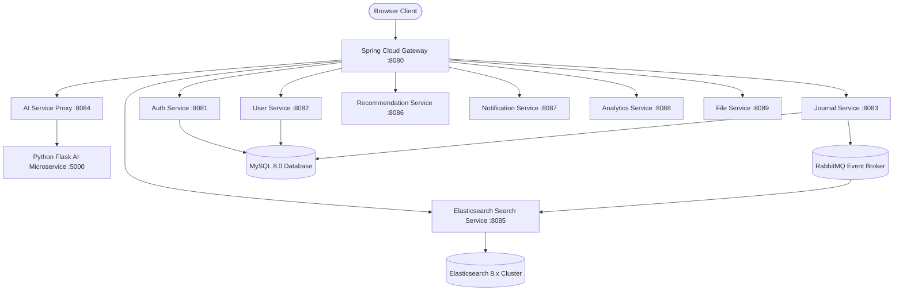

# AI Journaling Platform

A polyglot microservices AI journaling platform: **Java Spring Boot 3** services behind a **Spring Cloud Gateway**, a **Python Flask** AI microservice, **Elasticsearch** for search, **RabbitMQ** for the journal-indexing pipeline, and a **React 19 + TypeScript + Vite** frontend.

---

## System Architecture



Only `journal-service` (producer) and `search-service` (consumer) are actually wired to RabbitMQ today - `notification-service` and `analytics-service` are plain synchronous REST services with no broker involvement, despite an earlier version of this diagram implying otherwise. See [docs/ARCHITECTURE.md](docs/ARCHITECTURE.md) for the full service/dependency table and design-pattern notes, and [docs/ER_DIAGRAM.md](docs/ER_DIAGRAM.md) for the database schema.

---

## Features

- **Command palette** (`Cmd+K` / `Ctrl+K`) for quick navigation and actions.
- **Mood detection** across 7 categories (`HAPPY`, `EXCITED`, `RELAXED`, `STRESSED`, `SAD`, `GRATEFUL`, `ANGRY`), computed via `python-ai-service` and proxied through `ai-service`.
- **AI writing assistant**: rephrase, grammar fix, continue-writing, auto-tags, summarization.
- **Analytics dashboard**: mood radar chart, real consecutive-day streak, AI-level tiering based on entry count.
- **Elasticsearch-backed search**: full-text + mood/tag filtering, real relevance ranking (not client-side filtering).
- **TOTP-based two-factor authentication** with recovery codes, admin-triggered reset, and real login-history logging.
- **10-minute active session expiry**, JWT access/refresh tokens, gateway- and service-level auth enforcement.

---

## Microservices Directory

| Service | Port | Depends on | Purpose |
| :--- | :---: | :--- | :--- |
| `gateway-service` | 8080 | Eureka | API routing, CORS, JWT verification at the edge |
| `auth-service` | 8081 | MySQL (`auth_db`), Eureka | Registration, login, JWT issuance, TOTP 2FA |
| `user-service` | 8082 | MySQL (`user_db`), Eureka | Profile & preferences |
| `journal-service` | 8083 | MySQL (`journal_db`), RabbitMQ, Eureka | Journal CRUD, publishes create/update events |
| `ai-service` | 8084 | MySQL (`ai_db`), `python-ai-service`, Eureka | Proxies AI features to the Flask service |
| `search-service` | 8085 | Elasticsearch, RabbitMQ, Eureka | Full-text/mood/tag search, indexes journal events |
| `recommendation-service` | 8086 | `journal-service`, Eureka | Mood-bucketed prompts/books/exercises (curated content, not model-generated) |
| `notification-service` | 8087 | MySQL (`notification_db`), Eureka | Real push notifications (Expo) + a daily reminder scheduler |
| `analytics-service` | 8088 | `journal-service`, Eureka | Real journal insights (streaks, word counts, top topics) computed from the caller's entries |
| `file-service` | 8089 | Local disk, Eureka | Attachment upload/download |
| `python-ai-service` | 5000 | Flask, Hugging Face (optional) | Mood/summarize/rephrase/grammar NLP |
| `discovery-server` | 8761 | - | Eureka registry |

Each service has its own README with its full endpoint list - see the links in the table above's row, or browse each service directory directly (e.g. [auth-service/README.md](auth-service/README.md)).

---

## Quick Start (Docker Compose)

**Prerequisites:** Docker + Docker Compose, and a `.env` file at the repo root (copy [.env.example](.env.example) and fill in `JWT_SECRET` - generate one with `openssl rand -base64 64`).

```bash
# 1. Package backend services (skip tests for a faster first build)
mvn clean package -DskipTests

# 2. Launch the full stack
docker compose up --build -d
```

Frontend: `http://localhost:3000`. Gateway: `http://localhost:8080`. RabbitMQ management UI: `http://localhost:15672` (guest/guest). Every service also exposes Swagger UI at `http://localhost:<port>/swagger-ui.html` and a raw OpenAPI spec at `/v3/api-docs` - a versioned, diffable snapshot of each is also committed under [docs/openapi/](docs/openapi/) for browsing without a running stack. For exercising the full API through the gateway without a UI, import [docs/ai-journal-platform.postman_collection.json](docs/ai-journal-platform.postman_collection.json) - it covers every real endpoint, auto-saves your access token on login, and documents the couple of internal `ROLE_SYSTEM`-only routes that will correctly 403 with a normal user's JWT.

Without `.env`/`JWT_SECRET` set, every backend service fails to start on purpose (`${JWT_SECRET:?...}` in `docker-compose.yml`) - this is a deliberate fail-fast, not a bug.

## Local Development (without Docker)

Backend (per service, from its own directory or via `-pl`):
```bash
mvn -pl auth-service -am spring-boot:run
```
Needs a local MySQL instance per service's `application.yml` datasource (or point `SPRING_DATASOURCE_URL`/`SPRING_DATASOURCE_USERNAME`/`SPRING_DATASOURCE_PASSWORD` env vars at one), plus `JWT_SECRET`. `search-service` additionally needs a reachable Elasticsearch; `journal-service`/`search-service` need RabbitMQ.

Frontend:
```bash
cd frontend
npm install
npm run dev
```
The dev server proxies `/api/**` to `http://localhost:8080` (see `frontend/vite.config.js`) - no frontend env var is needed, just have the gateway running.

## Testing

```bash
# Backend - full reactor, all modules with tests
mvn test

# Frontend
cd frontend
npm run test        # Vitest
npm run typecheck    # tsc --noEmit
npm run lint         # oxlint
```

Some backend tests (journal-service's repository/messaging tests, user-service's repository test, search-service's Rabbit integration test) use Testcontainers and need a working Docker daemon reachable from the JVM.

---

## Repo layout

- `common-library/` - shared JWT filter/utils, `ApiResponse`/`PagedResponse` envelopes, RabbitMQ message-converter auto-config, used by every Java service.
- `<service>/` - one directory per Java microservice (see table above), each independently deployable.
- `python-ai-service/` - Flask NLP service, called by `ai-service`.
- `frontend/` - React 19 + TypeScript + Tailwind v4 SPA.
- `k8s/` - Kubernetes manifests for every service.
- `docs/` - architecture/ER diagrams, a Postman collection, and committed OpenAPI spec snapshots covering the full API.
- `CLIENT_HANDOFF_GUIDE.md` - a feature walkthrough/demo script, not developer documentation.
